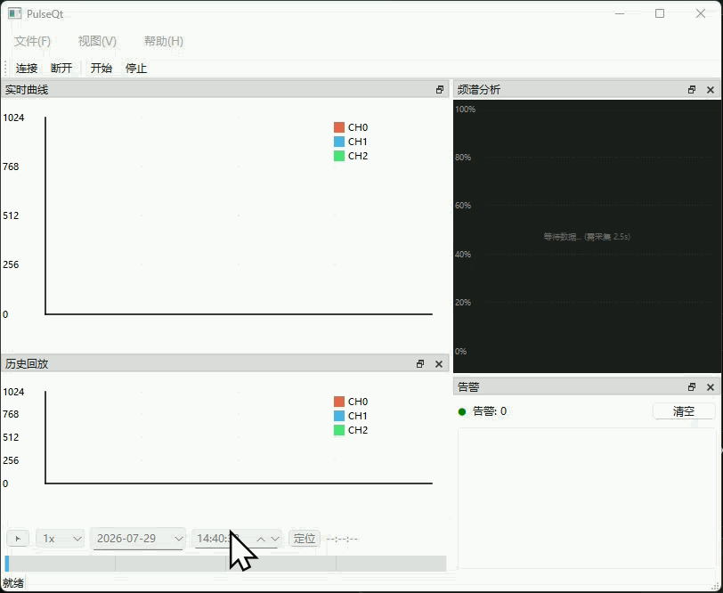
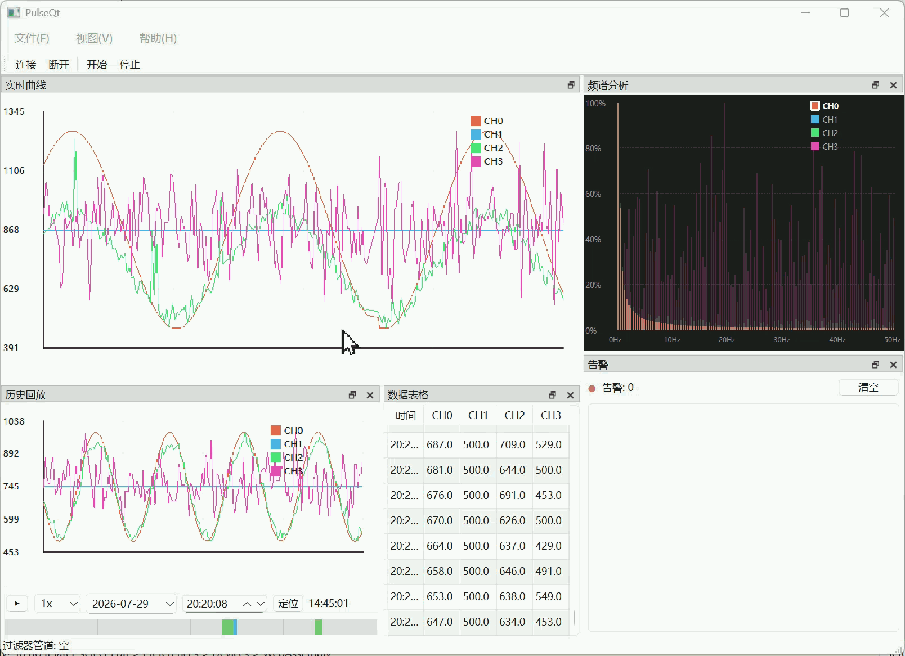
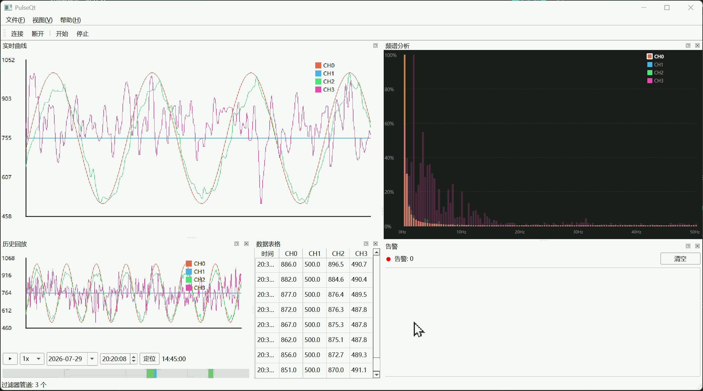
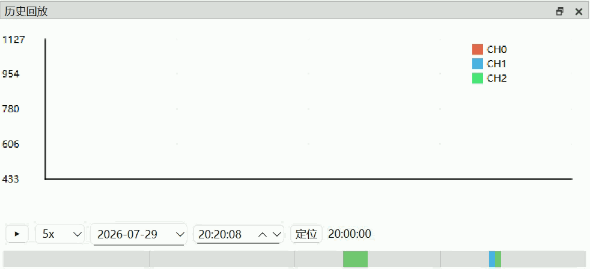
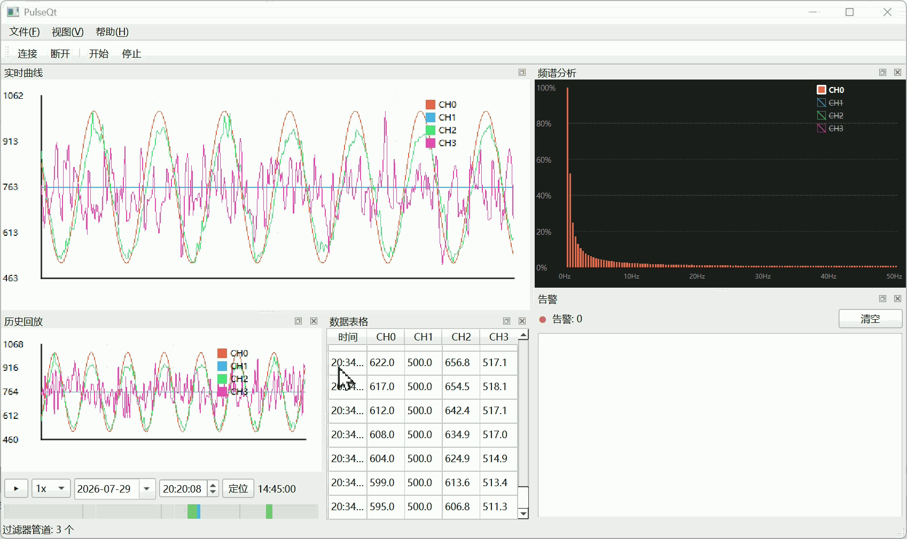

# PulseQt — 多通道工业数据采集与监控系统

> 基于 **Qt 6 / C++17** 的轻量级工业上位机。通过 TCP/串口接收传感器二进制数据流，提供实时曲线、FFT 频谱、可插拔数据管道、告警引擎、SQLite 持久化与中英文切换。
>
> **v1.3.0** · 53 单元测试 · 10 测试二进制 · 双平台 CI



---

## 1. 功能特性

### 通信与协议

| 模块 | 实现方式 |
|------|------|
| **双通道支持** | TCP 客户端 / 串口，基于 `IChannel` 虚接口可扩展 |
| **自定义二进制协议** | `0xA55A` 帧同步头 + 7 状态机粘包拆包 + CRC16-CCITT 校验 |
| **Modbus RTU** | 功能码 03/04，CRC16-Modbus 滑动窗口扫描，主站 10ms 轮询 |
| **双协议热切换** | `setProtocol("raw"|"modbus")` 运行时切换，共用同一 TCP/串口连接 |
| **断线重连** | 指数退避 1s→2s→4s→…→30s，心跳保活 5s×6 次 (30s 判定断线) |
| **握手协商** | 下位机声明通道数与数据类型 (uint8/uint16/int16/float)，上位机应答确认 |

### 数据处理管道

```
原始数据 → MovingAverage → Median → ThresholdAlarm → DataBuffer → SQLite
              │              │           │
         平滑去噪      剔除野值      阈值检测+滞回
```

| 过滤器 | 说明 |
|------|------|
| **MovingAverage** | 简单滑动窗口 / EMA 指数加权，窗口 2~30 可调 |
| **MedianFilter** | 脉冲野值免疫，`std::nth_element` O(N) |
| **ThresholdAlarm** | 每通道独立上下限 + 全局滞回防抖 |
| **IFilter 接口** | 纯虚，支持通道选择性过滤 (`setChannels({0,2})`) |



### 可视化

| 模块 | 功能 |
|------|------|
| **实时曲线** | QPainter 双缓冲自绘，抽稀优化，滚轮缩放 (5s~120s)，鼠标拖拽平移 |
| **FFT 频谱** | 256 点 Radix-2 FFT，25FPS 柱状图，Y 轴% + X 轴 Hz 标注 |
| **通道显隐** | 图例点击切换，每通道独立 Y 轴范围，小波动不再被大范围压缩 |


| **数据表格** | QAbstractTableModel + QTableView，100ms 节流刷新 |
| **历史回放** | QSlider 时间轴 + 播放/暂停 + 1×/2×/5×/10× 速度 |



### 告警系统

| 模块 | 功能 |
|------|------|
| **告警引擎** | 3 状态机 (Normal/AboveUpper/BelowLower) + 滞回 |
| **告警面板** | 红色闪烁指示器 + 告警列表 + SQLite 历史记录 |
| **限流抗压** | 同通道同方向 1s 去重，噪声洪流不崩溃 |

### 工程化

| 模块 | 功能 |
|------|------|
| **QDockWidget 布局** | 4 面板可拖拽/浮动/关闭，恢复默认布局 |
| **QSettings 持久化** | 连接参数 + 窗口布局 + 过滤器配置 + 主题全部记忆 |
| **多语言** | 中/英文切换 (QTranslator + .ts/.qm) |
| **Doxygen 文档** | `cmake --build build --target doc` 一键生成 HTML API 文档 |
| **NSIS 安装程序** | `dist/PulseQt_Setup_v1.3.0.exe` |
| **持续集成** | GitHub Actions Windows/Ubuntu 双平台 |

### 数据管理

| 模块 | 实现方式 |
|------|------|
| **环形缓冲** | DataBuffer 容量 10000 条，QMutex 跨线程安全 |
| **SQLite** | WAL 模式 + 100 条/批批量事务，QDataStream 序列化通道为 BLOB |
| **告警记录** | alarms 表 (timestamp, channel, value, threshold, state) |
| **CSV 导出** | 时间范围 + 通道选择 + Excel 兼容 |


| **自动清理** | 超 7 天数据自动 DELETE |

---

## 2. 技术栈

| 类别 | 选型 |
|------|------|
| 语言 | C++17 |
| UI | Qt 6 (Widgets / SerialPort / Network / Sql) |
| 构建 | CMake 3.20+ |
| 数据库 | SQLite 3 (Qt SQL 内置) |
| 测试 | QtTest (53 用例, 10 二进制) |
| 文档 | Doxygen + Markdown |
| 打包 | NSIS / windeployqt |

---

## 3. 系统架构

### 分层结构

```
┌─────────────────────────────────────────────────────────────────┐
│                         UI 层 (src/ui/)                         │
│  MainWindow · RealTimeChart · SpectrumWidget · AlarmPanel       │
│  DataTableModel · ExportDialog · FilterConfigDialog             │
│  ConnectionDialog · HistoryPlayer                               │
├─────────────────────────────────────────────────────────────────┤
│                      线程层 (src/worker/)                       │
│  ParseWorker: 解码 → 管道 → 缓冲 → SQLite                       │
├─────────────────────────────────────────────────────────────────┤
│                      数据层 (src/data/)                         │
│  DataBuffer · DatabaseManager                                   │
│  IFilter · FilterPipeline · MovingAverage · Median · Alarm     │
├─────────────────────────────────────────────────────────────────┤
│                      协议层 (src/protocol/)                     │
│  ProtocolDecoder (7 状态机) · ModbusDecoder (滑动 CRC)          │
│  ModbusMaster (定时轮询) · CRC16-CCITT/Modbus                   │
├─────────────────────────────────────────────────────────────────┤
│                    通信层 (src/communication/)                  │
│  ChannelManager · IChannel · TcpChannel · SerialChannel         │
│  ChannelRegistry (动态注册)                                      │
└─────────────────────────────────────────────────────────────────┘
```

### 三线程数据流

```
┌─ 通信线程 ─────────────────────────────────────────────┐
│  TcpChannel::readyRead → ChannelManager 转发            │
│                              │                         │
│                    QueuedConnection                     │
│                              ▼                         │
│  ┌─ 解析线程 ────────────────────────────────────┐     │
│  │  ProtocolDecoder / ModbusDecoder              │     │
│  │    → onFrameDecoded                          │     │
│  │    → FilterPipeline::process (MA→Median→Alarm)│     │
│  │    → DataBuffer::push + DatabaseManager::insert│    │
│  │    → emit dataPointReady                     │     │
│  └──────────────────┬───────────────────────────┘     │
│           QueuedConnection                             │
│                     ▼                                  │
│  ┌─ UI 线程 ────────────────────────────────────┐     │
│  │  RealTimeChart (25FPS) · SpectrumWidget      │     │
│  │  DataTableModel (100ms) · AlarmPanel         │     │
│  └──────────────────────────────────────────────┘     │
└───────────────────────────────────────────────────────┘
```

---

## 4. 快速开始

### 编译

```powershell
# Windows (MSVC)
git clone https://gitee.com/kiyose408/pulse_qt.git
cd pulse_qt
# Qt Creator 打开 CMakeLists.txt → 构建
```

```bash
# Linux
cmake -B build -DCMAKE_BUILD_TYPE=Release
cmake --build build -j$(nproc)
```

### 运行

```bash
./build/PulseQt    # Linux
build\Desktop_Qt_6_9_0_MSVC2022_64bit-Release\PulseQt.exe   # Windows
```

### 测试

```bash
# 无需硬件 — TCP 模拟
python tools/tcp_wave_simulator.py          # 干净正弦波
python tools/noisy_sensor_simulator.py      # 噪声 + 野值 (推荐)
```

启动 PulseQt → 工具栏"连接" → 选择 TCP → 127.0.0.1:9999 → 确认。

---

## 5. 测试

```bash
cd build && ctest -V
```

53 个测试用例，覆盖：协议解码、环形缓冲、数据库 CRUD、全链路集成、过滤器数学验证、告警状态机、Modbus CRC。

---

## 6. 项目结构

```
PulseQt/
├── include/                    31 头文件
│   ├── ui/                     MainWindow, RealTimeChart, SpectrumWidget, AlarmPanel, ...
│   ├── data/                   DataBuffer, DatabaseManager, IFilter, FilterPipeline, ...
│   ├── protocol/               ProtocolDecoder, ModbusDecoder, ModbusMaster, Frame, ...
│   ├── communication/          ChannelManager, IChannel, TcpChannel, SerialChannel, ...
│   ├── worker/                 ParseWorker
│   └── utils/                  Logger, FFT, ChannelColors
├── src/                        28 源文件 (5 子目录对应 include)
├── tests/                      10 测试文件 (QtTest)
├── tools/                      13 工具脚本 (噪声/Modbus/Fuzzing/打包)
├── doc/                        设计文档 + Doxyfile
├── docs/                       20 技术笔记 (Markdown)
├── resources/                  翻译文件 (.ts/.qm)
└── dist/                       发布包 + NSIS 安装脚本
```

---

## 7. 性能

| 指标 | 实测值 |
|------|:--:|
| 帧解码 | 100Hz (10ms/帧) |
| 曲线刷新 | 25FPS |
| FFT (256pt) | < 0.5ms |
| SQLite 写入 | ≥ 500 条/秒 |
| 内存 | < 80MB |
| 抽稀后曲线点数 | ~800 点/30s 窗口 |

---

## 8. 许可证

MIT License

---

## 9. 开发者

**Kiyose** · [Gitee](https://gitee.com/kiyose408/pulse_qt) · v1.3.0 (2026-07-25)
